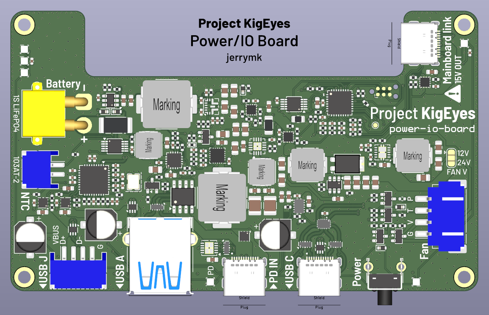
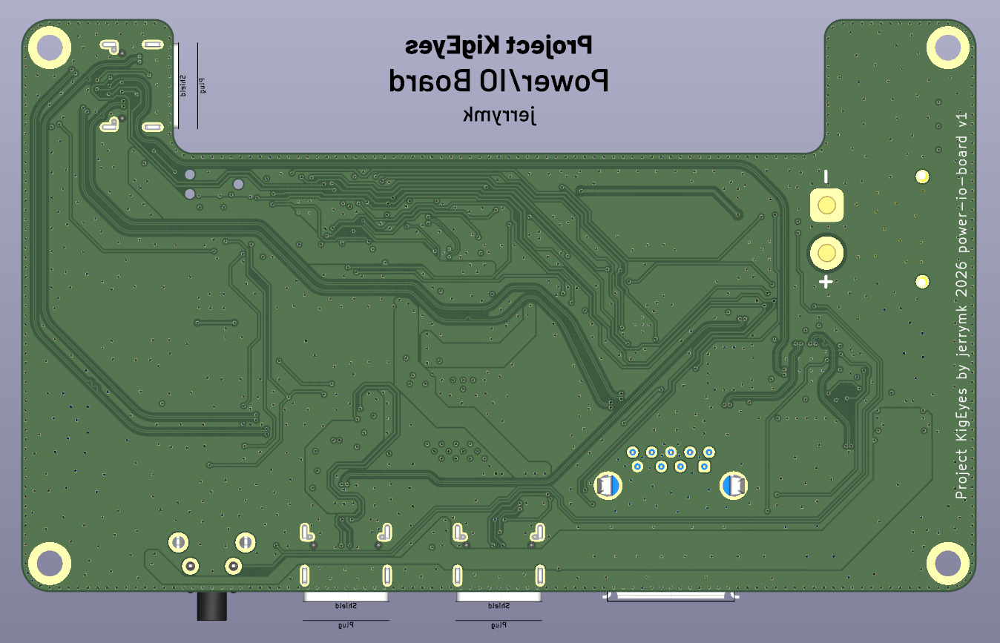

# Project KigEyes PCBs

## kigeyes-mainboard

| versions | status |
| :-- | :-- |
| v1 | work in progress |

- Type C (custom protocol) power input (up to 15V) from `kigeyes-power-io-board`, includes single USB 2.0, dual USB 3.2 Gen 1, and I2C
- Raspberry Pi Compute Module 5
- HDMI to DisplayPort to Type C DP Alt mode converter
- MIPI camera multiplexer to connect up to 4 cameras (2 active at once)

## kigeyes-power-io-board

| versions | status |
| :-- | :-- |
| [v1](https://github.com/jrymk/KigEyes/tree/03120d87e7e96c838e76b844e53821a05b18d4d7/PCB/kigeyes-power-io-board) | design ready, untested |

- USB PD input (up to 15V 3A)
- 1S LiFePO4 BQ25306 charger (up to 3A) and voltage booster
- Type C (custom protocol) power output (5~15V) to `kigeyes-mainboard`
- USB 2.0 hub
- USB Type C DFP (5V 1.5A, USB 3.2 Gen 1, PD-compliant)
- USB Type A DFP (5V 0.9A guaranteed, USB 3.2 Gen 1)
- USB Port J (JST PH, USB 2.0)
- 24V/12V fan output with speed control

## eye-tracker-mainboard

| versions | status |
| :-- | :-- |
| [a1](https://github.com/jrymk/KigEyes/tree/e749d2dd36b2bbe4de054390257230e3775aa7c6/PCB/archive/eye-tracker-mainboard) | scrapped |
| v1 | postponed |

- Dual ESP32P4 processors
- Connectors to `OVM6211-fpc`
- USB 2.0 hub